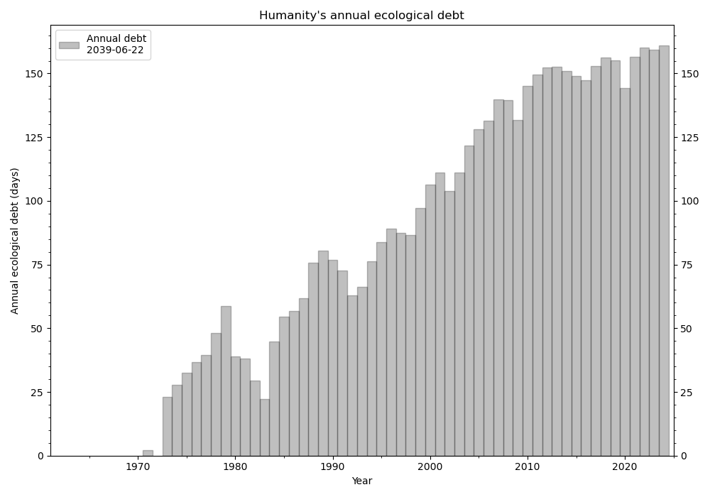
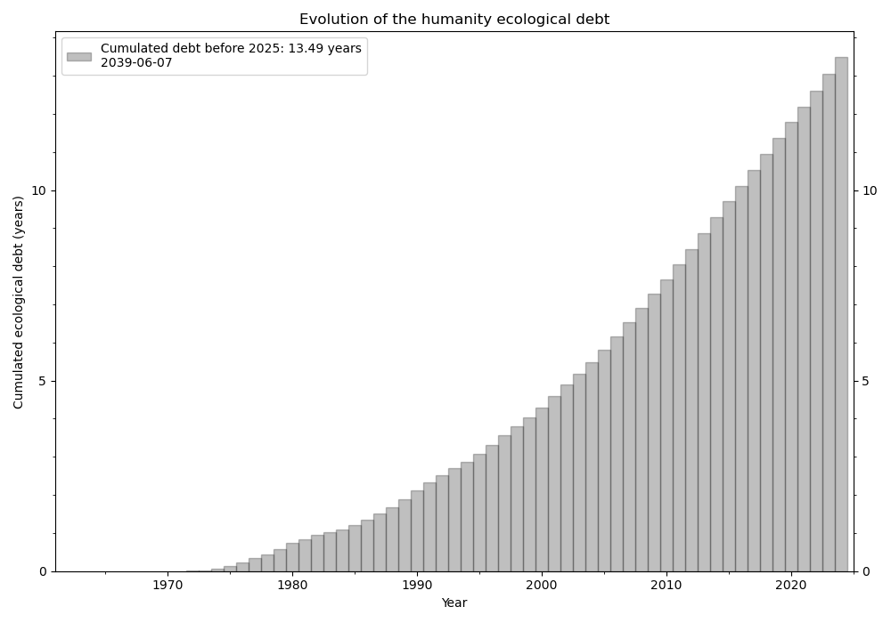

# Ecological debt of humanity: calculation and evolution

Every year since 1971, the [Global Footprint Network](https://www.footprintnetwork.org/)
announces the [Earth Overshoot Day](https://overshoot.footprintnetwork.org/about-earth-overshoot-day/)
which marks the date when humanity starts using more resources than what Earth
can regenerate in that year.

The Earth Overshoot Day is calculated for a given year. However, the excess of
resources consumption does not reset at the end of the year. Instead, it
accumulates in time into an "ecological debt". This project aims at calculating
this "ecological debt", which I define here as the cumulative number of days
after the annual Earth Overshoot Day. If one year, the Earth Overshoot Day is
not reached, then the unused time is deducted from the debt. Note that the debt
cannot be negative: the Earth does not appart ressources for later.
The GitHub repository is
[here](https://github.com/qsalome/Earth_overshoot_debt).

## Install

The project is based on Python 3.10. I recommend to use conda and the provided
`environment.yml` file:

    $ conda env create -f environment.yml

## Data

The project uses the data of the Footprint Data Foundation, the York University
Ecological Footprint Initiative, and the Global Footprint Network:
https://data.footprintnetwork.org

While the data are accessible with API, I am facing an issue to setup the API
to read the data directly in the code. So far, the project requires to manually
download the data into csv files from
[here](https://data.footprintnetwork.org/#/countryTrends).\
Warning: make sure that you selected the option `Ecological Footprint vs
Biocapacity (gha per person)`.\
Once I could successfully setup the API, I will push the updates in the
repository.
<!--
accessible with API.
An API key can be obtained [here](https://data.footprintnetwork.org/#/api).
-->

The geometry shape of the countries come from the 'Admin 0 - Countries' dataset
of [Natural Earth](https://www.naturalearthdata.com/), available
[here](https://www.naturalearthdata.com/downloads/10m-cultural-vectors/10m-admin-0-countries/).

## Method

The Ecological Footprint data provide the Ecological Footprint and the
Biocapacity per person for each country. The data also provide the same quantity
for the World population.
Two methods are used to calculate the ecological debt of a country: the "local"
based on the Deficit Day and the "global" debt based on the Overshoot Day.

The Overshoot Day is the day when humanity's demand for ecological resources
and services exceeds what Earth can regenerate in a year. The Overshoot Day is
given by:

    (number of days in the year)*(biocapacity per person)/(ecological footprint per person)

For a country, the Overshoot Day can also be calculated and corresponds to the
Overshoot Day if all humanity lived like the residents of the country. The
Overshoot Day of a country is given by:

    (number of days in the year)*(local biocapacity per person)/(global ecological footprint per person)

In other world, if the residents of a country consume more per person that the 
humanity as a whole, the Overshoot Day of this country occurs earlier that the
World Overshoot Day.

The Deficit Day is the day by which the residents of a country have used as much
ressources from nature as the country's ecosystems regenerate in the entire
year. The Deficit Day is given by:

    (number of days in the year)*(local biocapacity per person)/(local ecological footprint per person)

The annual "local" and "global" debts are estimated by considering the number
of days following the country's Deficit Day and Overshoot Day, respectively.
The total debts are the sum of the annual debts.

## Simple example

The `data` folder contains some csv files as an example. Additional csv files
can be added to the folder, the code will take those files into account.
To compile the data and calculate the "ecological debts":

    $ python ecological_debt.py

{: style="height:83px"}
{: style="height:83px"}

The file `data/Local_and_global_ecological_debt_countries.gpkg` compiles the
Overshoot Day, Deficit Day, local debt and global debt for the World, the EU
countries and the United Kindgom.
This file can be used to create an interactive map showing the local and global
debt of the countries since 1961.

    $ python interactive_map.py

The html file can be seen and explored
[here](html/ecological_debts_countries.html)

## Bugs and development

I welcome all changes/ideas/suggestion, big or small, that aim at improving
the projects. Feel free to fork the repository on GitHub and create pull
requests.
Please report any bugs that you find
[here](https://github.com/qsalome/Earth_overshoot_debt/issues).

